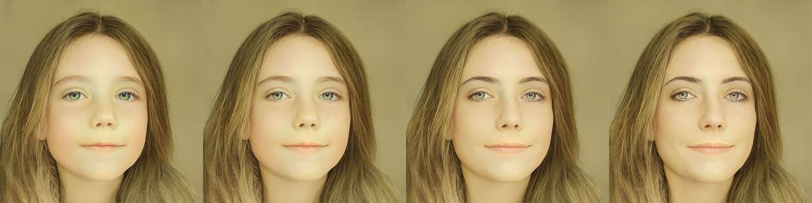
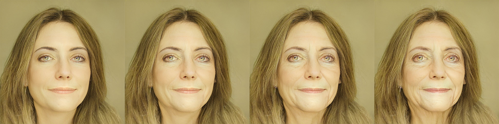
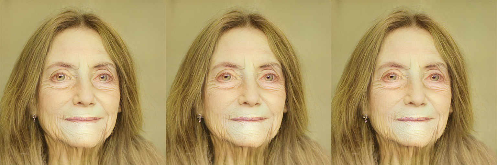

# sam-aging

### About

I was approached by Sina Rohde (MA Production), as she was preparing a presentation about machine learning based methods for age manipulation in movies. As a result, I built this repository as a complement to the [replicate implementation](https://replicate.com/yuval-alaluf/sam) of the paper [Only a Matter of Style: Age Transformation Using a Style-Based Regression Model](https://doi.org/10.48550/arXiv.2102.02754).

### Usage

If you want to try out the model yourself, please refer to the [replicate implementation](https://replicate.com/yuval-alaluf/sam?input=docker). Once the model is running on your machine, you can use the script `./py/main.py` to feed all of the images from a specified folder to the model and generate multiple target age transformations for each image.

```bash
# requires poetry to be installed on your machine
cd to/project/root
poetry install
poetry run python ./py/main.py
```

### Considerations

The following models were considered for this project:

- [SAM](https://github.com/yuval-alaluf/SAM) (Final Selection)

  - high quality results
  - model weights are freely available
  - open-source implementation
  - robust docker container available

- [Fast-AgingGAN](https://github.com/HasnainRaz/Fast-AgingGAN)

  - medium quality results
  - model weights are freely available
  - open-source implementation

- [Production-Ready Face Re-Aging for Visual Effects](https://studios.disneyresearch.com/2022/11/30/production-ready-face-re-aging-for-visual-effects/)

  - highest quality results
  - model weights are not freely available
  - no open-source implementation available

### Understanding

The SAM model is designed to transform facial images to show how a person might look at different ages. Under the hood, it is composed of two neural networks:

- A StyleGAN-based `generator` to create realistic faces
- An age `regression network` to guide the transformation

When an input image enters the system, it first goes through an encoder that breaks down the image into different levels of detail. This encoder then transforms those details into a special representation that can be manipulated. The original image is also encoded separately. The two encodings are then combined, with a specific focus on transforming the image to the desired age. This combined representation is fed into the pre-trained image generation model, which produces the final age-transformed image.

### Goals

Even though the model outputs images, the main goal was to create a `short video` clip to demonstrate on custom footage what the model is capable of. To achieve this, the following steps were taken:

- [x] Running docker image

  - setup und configure docker
  - run model

- [x] Frame processing pipeline

  - interface with api via python script
  - create automatic frame processing workflow

- [x] Result generation

  - extract frames from video
  - process frames with model
  - reassemble frames into video

### Input Footage


> 4 second clip (individual 225 Frames)

### Output


> 4 second clip with a target age of 60 years



> from left to right ages `01, 10, 20, 30`



> from left to right ages `40, 50, 60, 70`



> from left to right ages `80, 90, 100`

All full resolution output images and videos are available on [Google Drive](https://drive.google.com/file/d/1kVN8lA6VCZjAq6EupbsEfB7ZTp46gSoV/view?usp=drive_link)

### Analysis

- Image generation takes around 10 seconds per frame
- Individual frames have a high quality when looking at the facial features exclusively

---

- Head rotation and facial expressions are not translated well with this model
- The model is not intended for video processing (temporal coherence issues)
- Areas around the face (Hair, Ears, Neck etc.) are particularly true to the input

### Conclusion

Although the output is fascinating in its own regard, real world application of this exact model for Re- and De-Aging in the VFX pipeline is not feasible. For a convincing result, a lot of manual labor is still involved with this approach. Another major issue with this technique is the loss of facial expressions. The resulting output images all share a very similar facial expression which is not ideal when trying to convey an actor's performance in a shot.

The closed-source [approach](https://studios.disneyresearch.com/2022/11/30/production-ready-face-re-aging-for-visual-effects/) by Disney is much more capable and even takes care of the whole processing pipeline from video to video automatically. Unfortunately, at the time of writing this, to my knowledge no open-source implementation of this model is available.
